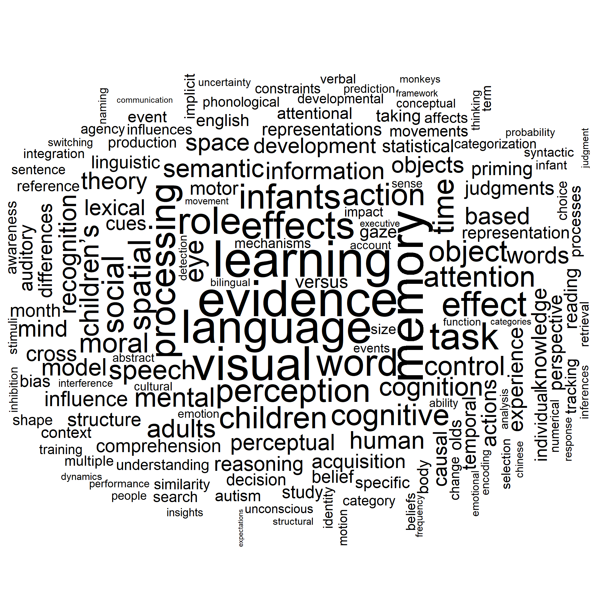

```{r setup, include=FALSE}
library(flexdashboard)
library(flexdashboard)
library(tidyverse)
library(reticulate)
library(tidytext)
library(ggwordcloud)
```

Column {data-width=350}
-----------------------------------------------------------------------

### Discussion

This page generates journal article titles based on a corpus of titles from the journal "Cognition". Output is genrated from a corpus of 2000+ journal titles dating from 1994 to present day. 

Each title varies in length and in how closely it can resemble the source material. So some will seem tame, and some, less so. Refresh to see new output.

Each output includes 10 potential titles.

NOTE: Output will occasionally return "None" when a generated title too closely matches the training corpus.

```{r}

```

Column {data-width=650}
-----------------------------------------------------------------------

### Cognition Titles

```{python}
import markovify
import random

# Get raw text as string.
with open("titles.txt") as f:
    text = f.read()

text_model = markovify.NewlineText(text)

# Print ten randomly-generated sentences using the built model
for i in range(10):
    print(text_model.make_short_sentence(max_chars = random.randint(50,150), max_overlap_ratio = random.uniform(.4, .8)))
```

**Referesh to Update!**

### Most Frequently Used Words



